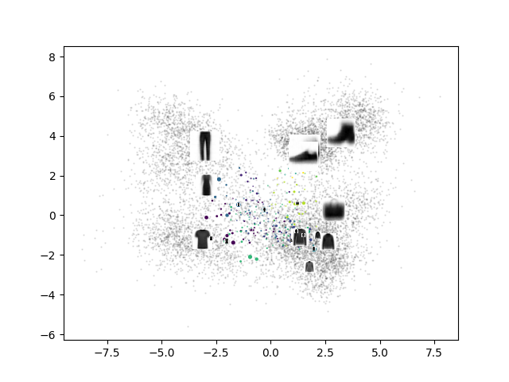
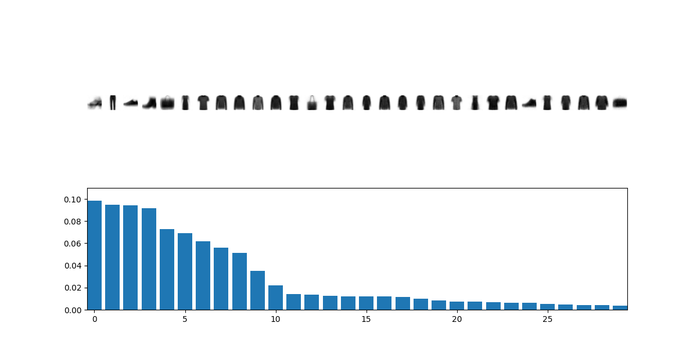
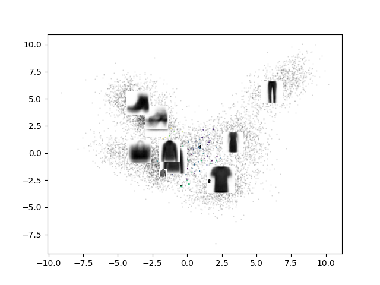
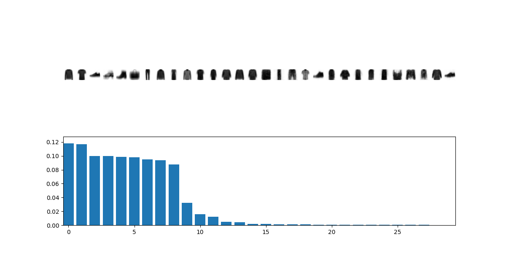
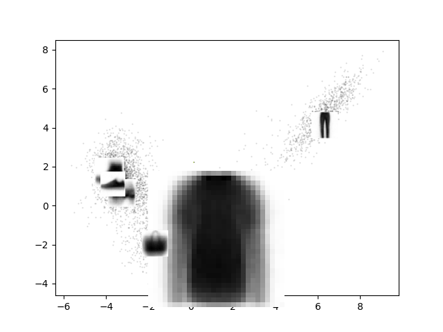
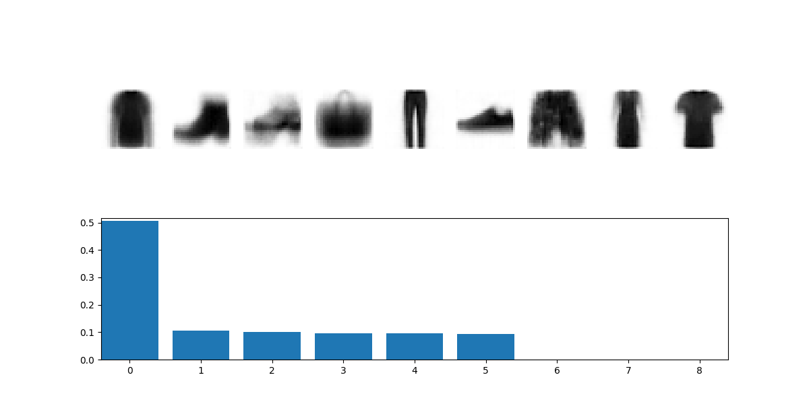
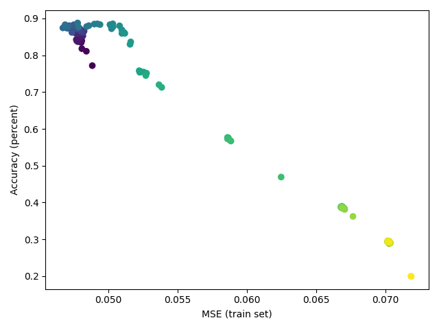
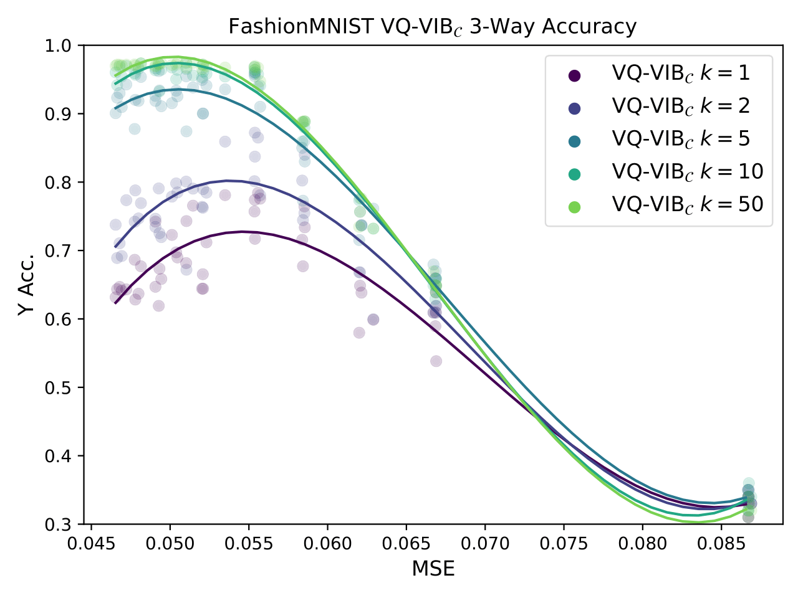

# Human-Guided Complexity-Controlled Abstractions

This codebase implements some of the key computational experiments from the NeurIPS paper: [Human-Guided Complexity-Controlled Abstractions](https://neurips.cc/virtual/2023/poster/70201).

## Code structure
All of the code is within ``human_guided_abstractions/``.
Within that directory, there are subdirectories for different types code: ``data_utils`` contains data-loading code; ``models`` contains the network architectures for different neural networks, and ``scripts`` contains the simple scripts for training and testing models. The other subdirectories contain some useful utilities but are not as relevant to most people.

There are also directories for configuration (``config``) that specify how to pre-train models, and a directory for saving models and interesting figures (``figures``) that saves snapshots and results.

## Setup instructions

1. Install requirements via creating a conda env called ``abstractions``
```
        conda env create -f environment.yml
```
2. Install the dir as an importable module
```
        pip install -e .
```

## Train FashionMNIST models.

Here, we'll walk through the simple steps to recreate a basic version of our FashionMNIST experiments (but, for the sake of running quickly, we won't run lots of random trials).

``complexity_concepts/scripts/main`` is the script we will use to pre-train the model.
We want to train a VQ-VIBC model, so we need to pass in the relevant config.
The parameters already stored in ``config/fashion_mnist/vqvibc_config.yaml`` should be good, but of course you can edit them if you want.

To kick off pre-training, run (after activating the conda environment)

```
        python complexity_concepts/scripts/main.py config/fashion_mnist/vqvibc_config.yaml
```

You'll quickly see printouts at every epoch saying the model is training, and some metrics of performance.
If you want to load graphics while it's training, look within ``figures/fashion_mnist/``.
The script auto-populates directories with lots of checkpoints during training (with different paths encoding things like the model type, the value of n).
The ``mse_acc.png`` figures are quite interesting, as they show the evolution, over the course of training, of the model's MSE and accuracy (on the pre-training task).
You can also look at the PCA figures (``pca.png``) or the probability distribution over prototypes over the course of training (``vqs.png``).

After some large number of epochs, specified in the config file, pre-training will terminate.
Now, we will finetune models to see the finetuning accuracy as a function of model complexity.

Run the script

```
        python complexity_concepts/scripts/finetune.py
```

The script has been hard-coded to load model checkpoints generated by ``main.py``; if you change parameters in training, or want to finetune something else, you'll have to edit some basic variables at the bottom of the ``finetune.py`` script.

The finetuning script loads model checkpoints within a range of epoch values and finetunes on a particular task, and evaluates performance after finetuning for each model.
We use 10 random trials for each finetuning test, just because the results depend a lot upon what (randomly-selected) data are loaded.

After the finetuning script has finished running, the data will be saved in ``csv`` files in relevant directories (e.g. ``finetune_results_crude3_0_timestep.csv`` is for finetuning on the 3-way fashionMNIST task, with random seed 0).

You can read the ``csv`` files directly, or you can plot the results via a plotting script (to generate the some of the figures we published in our paper).
Run

```
        python complexity_concepts/scripts/plot_finetune_results.py
```

As in ``finetune.py``, this script is hardcoded to load results from particular paths, so if you deviate from the default parameters, you'll have to edit it.
In general, the script loads the csv files that were generated during finetuning and generates lots of plots based on the data.


## Example results

Here are examples of what your results should look like after executing the previous steps.


Left column is PCA, and right column is histogram over different prototype uses. Note how over the course of annealing (moving down the table), VQ-VIBC uses fewer prototypes.

| PCA                                                                                                             | VQs                                                                                             |
|-----------------------------------------------------------------------------------------------------------------|-------------------------------------------------------------------------------------------------|
|  |  |
|  |  |
|  |  |


And here's an example of Accuracy vs. MSE showing the annealing process (different colors by epoch)



And here's an example of the finetuning performance plots generated for the same models.




## Generating further results

This codebase contains config files for training VAE and VQ-VIBN models on the same FashionMNIST task.
Just swap out the config you pass in to training, and then edit the finetuning and plotting scripts to point to the new saved models.

Of course, altering different config values, such as the relative weights for complexity, entropy, or reconstruction, can be used to test other minor tweaks to the setup.


## Cite the paper

If you find this code useful, please cite our paper:

```
@inproceedings{
  pengtucker2023human,
  title={Human-Guided Complexity-Controlled Abstractions},
  author={Andi Peng* and Mycal Tucker* and  Eoin Kenny and Noga Zaslavsky and Pulkit Agrawal and Julie Shah},
  booktitle={Thirty-seventh Conference on Neural Information Processing Systems},
  editor={Alice H. Oh and Alekh Agarwal and Danielle Belgrave and Kyunghyun Cho},
  year={2023},
  url={https://openreview.net/forum?id=tSEeRl7ACo}
}
```

If you have further questions, please contact Mycal Tucker at mycal@mit.edu.